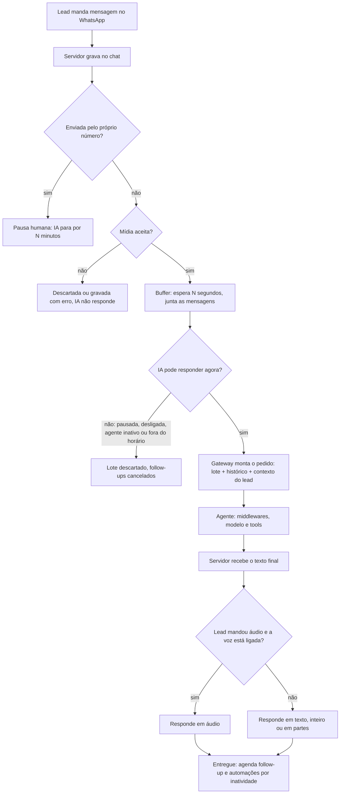

Uma mensagem do lead passa por duas partes. O **servidor da Zatten** recebe,
espera o lead terminar de escrever, decide se a IA pode responder e entrega a
resposta no WhatsApp. O **agente** (o LangChain Agent) lê a conversa, chama as
tools e escreve a resposta. Saber qual parte faz o quê diz onde configurar cada
coisa e onde procurar quando algo dá errado.

Esta página descreve o **LangChain Agent**, o motor da Zatten. Projetos no motor
antigo devem [migrar](/engenharia-de-ia/migrar).

## O caminho de uma mensagem

### 1. A mensagem chega e é gravada

Vale para as três conexões (oficial, coexistência e não oficial). A mensagem
aparece em **Conversas** antes de qualquer decisão sobre a IA. A exceção são
figurinha, localização e reação na conexão oficial e na coexistência: são
descartadas antes de gravar (ver o passo 2).

Se a mensagem foi enviada **pelo próprio número do projeto** (um humano
respondendo pelo app do WhatsApp), ela não vai para a IA: dispara a
[pausa humana](/engenharia-de-ia/pausa-humana). Responder pelo chat da Zatten
também pausa.

### 2. A mídia é filtrada

Texto, áudio, imagem e PDF seguem. Na conexão oficial e na coexistência:

- **vídeo** e **documento que não seja PDF** são gravados no chat com o erro
  `ERROR_UNSUPPORTED_MEDIA` e não chegam ao agente;
- **figurinha, localização e reação** são descartadas antes de gravar: não
  aparecem no chat e a IA não responde;
- áudio, imagem ou PDF também param aqui se a interpretação daquele tipo estiver
  desligada (ver Armadilhas).

Na conexão não oficial o filtro é outro (vídeo e figurinha seguem como mídia). A
tabela por conexão está em [Mídia: áudio, imagem e PDF](/engenharia-de-ia/midia).
Se o agente entende a imagem ou o PDF depende do modelo escolhido; o áudio é
transcrito antes.

### 3. O buffer junta as mensagens

O servidor espera o tempo do [buffer](/engenharia-de-ia/buffer) (no painel,
**Tempo de espera**, em **segundos**). Cada mensagem nova do lead reinicia a
contagem. Quando o tempo passa sem mensagem nova, tudo o que chegou vira **um
lote** e recebe **uma** resposta.

Se o lead escreve enquanto o agente ainda está respondendo, essas mensagens
formam o próximo lote, processado logo depois.

### 4. A IA pode responder agora?

Antes de chamar o agente, o servidor confere três coisas:

| Checagem | Onde se configura | Se falhar |
|---|---|---|
| A IA está **pausada** ou **desligada** para este lead? | Pausa humana, coluna que desliga a IA, coluna de transbordo, ação "Desligar a IA", botão no chat | Não responde |
| O agente está **Ativo**? | Chave Ativo/Inativo na tela **Agente** | Não responde |
| Está dentro do **Horário de funcionamento**? | Ícone de relógio na tela **Agente** (fuso, dias e janelas) | Não responde |

Quando a IA não pode responder, o lote é **descartado**: não fica guardado para
a IA responder depois. Os follow-ups e o transbordo por inatividade pendentes
desse lead são cancelados. As mensagens continuam no chat para um humano.

<Note>
No **Horário de funcionamento**, um dia sem nenhuma janela fica ligado o dia
inteiro. Para a IA não responder num dia, desligue-a de outro jeito ou cadastre
uma janela mínima. Sem fuso definido, o horário não vale.
</Note>

### 5. O gateway monta o pedido

O gateway é a ponte entre o servidor e o agente. Ele envia:

- **as mensagens do lote**: texto como texto, áudio como arquivo de áudio,
  imagem e PDF como link;
- **o histórico que o agente ainda não viu**: tudo o que aconteceu desde a última
  resposta da IA, inclusive o que um humano escreveu durante uma pausa. Na
  primeira mensagem depois de uma migração, as últimas mensagens da conversa (o
  número vem de `message_quantity`, mínimo 20);
- **o contexto do lead**: nome, WhatsApp, notas, tags, coluna do funil e as
  propriedades marcadas para ir à IA. Ver
  [O que a Zatten injeta no contexto](/engenharia-de-ia/contexto-injetado).

O gateway usa a **versão publicada** do agente e a relê a cada **até 2 minutos**.
Por isso uma publicação leva até 2 minutos para chegar às conversas em andamento
([Versões e publicação](/engenharia-de-ia/versoes-e-publicacao)). Cada resposta
tem até **180 segundos** para ficar pronta, contando todas as tools.

### 6. O agente pensa e age

O agente é montado a cada mensagem a partir do config publicado. A conversa
passa por uma sequência de **middlewares** (peças que agem antes e depois de
cada chamada ao modelo) e depois pelo modelo, que pode chamar tools quantas
vezes precisar antes de escrever a resposta final.

A ordem, de fora para dentro:

1. **Sincronização com a Zatten**: grava cada chamada de tool e o resultado no
   histórico do lead (aparecem como `FUNCTION_CALL` e `FUNCTION_CALL_OUTPUT`).
2. **Reparo do histórico**: corrige pedidos de tool que ficaram sem resposta, que
   fariam o provider recusar a conversa inteira.
3. **Contexto volátil**: acrescenta, no fim, o bloco "Contexto do lead atual" (se
   ligado) e o bloco "Agora" com data e hora de Brasília. O prompt fica fixo, o
   que aproveita o cache do provider.
4. **Transcrição**: converte áudio em texto antes de o modelo ver.
5. **Tratamento de erro → fallback → retry**: o que acontece quando o modelo
   falha. Ver [Resiliência](/engenharia-de-ia/resiliencia).
6. **Retry de tools, limite de chamadas, limpeza de contexto, resumo, proteção
   de dados pessoais e seletor de tools**: só os que estiverem ligados. Ver
   [Conversas longas](/engenharia-de-ia/conversas-longas) e
   [Limites e segurança](/engenharia-de-ia/limites-e-seguranca).
7. **Lista de tarefas**, se o agente tiver a tool
   ([Lista de tarefas](/engenharia-de-ia/lista-de-tarefas)).

As tools podem ser [ações da Zatten](/engenharia-de-ia/tools/acoes-da-zatten)
(mover no funil, tag, transferir), [HTTP](/engenharia-de-ia/tools/http),
[Composio](/engenharia-de-ia/tools/composio), [MCP](/engenharia-de-ia/tools/mcp)
ou [skills](/engenharia-de-ia/skills). Uma ação da Zatten muda o lead na hora:
se o agente move o lead para uma coluna que desliga a IA, a próxima mensagem já
não é respondida.

### 7. A resposta volta e é entregue

O servidor pega o último texto do agente e:

1. converte a formatação Markdown para a do WhatsApp;
2. se o texto traz um link de arquivo no formato `[legenda](https://...?filename=nome.pdf)`,
   envia o texto antes do link e o arquivo como documento;
3. se o lote tinha **áudio** do lead e a **voz** (ElevenLabs) está ligada, responde
   em áudio. Se gerar o áudio falhar, manda em texto;
4. senão, com a **segmentação** ligada, divide a resposta em frases e manda uma
   por vez, com "digitando…" (na conexão oficial) e uma espera de 25 ms por
   caractere entre as partes. Desligada, manda uma mensagem só.

Ver [Segmentação e voz](/engenharia-de-ia/segmentacao-e-voz). Os tokens de
entrada e saída ficam gravados na resposta e somam nas
[Métricas](/produto/metricas).

### 8. Depois da entrega

Quando a resposta é entregue, o servidor agenda as automações que contam tempo
sem resposta do lead: follow-up, transbordo por inatividade e webhook por
inatividade. A próxima mensagem do lead cancela o que estava pendente. Ver
[Quando as automações disparam](/produto/automacoes/quando-disparam).

## O que é do servidor e o que é do agente

| Peça | Quem aplica | Onde se configura | No template |
|---|---|---|---|
| Buffer, pausa humana, segmentação | Servidor | **Agente → Configurações avançadas** | bloco `llm_attendant` |
| Voz (ElevenLabs) | Servidor | Sem tela no builder do LangChain Agent: só pelo template | bloco `llm_attendant` |
| Ativo/Inativo, Horário de funcionamento | Servidor | Topo da tela **Agente** | não viaja |
| Filtro de mídia | Servidor | Não aparece no builder do LangChain Agent | `llm_attendant`: `audio_interpretation`, `image_interpretation`, `pdf_interpretation` |
| Modelo, prompt, tools, skills | Agente | **Agente** (builder) | bloco `langchain` |
| Retry, fallback, mensagem de erro | Agente | **Configurações do modelo** e **Falha do agente** | bloco `langchain` |
| Transcrição de áudio | Agente | Automática (não aparece na tela) | bloco `langchain` |
| Resumo, limite de chamadas, LangSmith | Agente | Builder | bloco `langchain` |

Buffer, pausa, segmentação e voz são do servidor, por isso valem igual nos dois
motores. Referência dos blocos em
[Referência do template](/trabalhar-com-ia/referencia-do-template).

## Se algo falha no caminho

- **O modelo falhou** (fora do ar, sem crédito, chave errada): o agente tenta de
  novo, troca para o modelo de reserva e, se todos falharem, manda a mensagem de
  erro ao lead e pode transferir para um humano. Ver
  [Resiliência](/engenharia-de-ia/resiliencia).
- **O agente não respondeu** (passou de 180 segundos, ou o serviço do agente
  falhou): o servidor tenta o mesmo lote de novo, até **3 vezes**, com **10
  segundos** entre as tentativas. Se todas falharem, grava o erro no chat e
  dispara o webhook de erro.

Com **Falha do agente** desligada, a falha do modelo vira falha do agente e cai
nessas 3 tentativas do servidor. O lead não recebe nenhuma mensagem.

## Pelo MCP

O assistente vê as duas partes no `get_template`:

- `llm_attendant`: `message_buffer` (segundos), `pause_in_human_interaction`
  (minutos), `message_segmentation`, `eleven_labs` e o motor em `llm`.
- `langchain.config`: modelo, instruções, tools e `settings`.

Ativo/Inativo e Horário de funcionamento não estão no template: confira no
painel.

<Visibility for="agents">
- `llm_attendant.llm` = `LANGCHAIN_AGENT` indica o motor atual. Outros valores
  (`OPENAI_RESPONSES`, `OPEN_ROUTER`) são o motor antigo.
- Estados da IA por lead: bloqueio no passado ou nulo = ligada; até 50 anos no
  futuro = pausada; 50 anos ou mais = desligada (desligar grava agora + 100 anos).
- Run do agente: timeout de 180 s no gateway. Config publicada em cache por
  120 s.
- Fila do buffer: 3 tentativas, 10 s fixos entre elas. Mensagens que chegam
  durante um run ativo entram no próximo lote, com `shouldReply`.
- Ordem real dos middlewares: ZattenSync → OrphanToolCall → VolatileContext →
  Transcription → ModelErrorHandoff → ModelFallback → ModelRetry → ToolRetry →
  ModelCallLimit → ContextEditing → Summarization → PII → LLMToolSelector →
  TodoList → HITL (sempre desligado).
</Visibility>

## Armadilhas

- **Buffer 0 ou vazio**: a mensagem é gravada, mas não vai para a IA. Use pelo
  menos 1 segundo.
- **Mensagens durante a pausa não são respondidas depois.** Quando a IA volta, ela
  espera a próxima mensagem do lead. O que foi dito na pausa entra só como
  histórico.
- **Dia sem janela no Horário de funcionamento fica ligado o dia todo**, não
  desligado.
- **Publicar não é instantâneo**: até 2 minutos para as conversas em andamento.
- **Tools lentas somam no limite de 180 segundos.** Um agente que encadeia várias
  chamadas a APIs lentas pode estourar o tempo e cair nas tentativas do servidor.
- **Interpretação de mídia desligada no motor antigo continua valendo.** Na
  conexão oficial, o servidor ainda consulta `audio_interpretation`,
  `image_interpretation` e `pdf_interpretation` de `llm_attendant`. Se estiverem
  `false`, a mídia é gravada com `ERROR_MEDIA_INTERPRETATION` e não chega ao
  agente, mesmo no LangChain Agent. Essas chaves não aparecem no builder; mude
  pelo template. Na conexão não oficial, só `pdf_interpretation` é conferida.
- **A voz só responde em áudio quando o lote tem áudio do lead.** Para texto, a
  resposta é sempre texto.

## Perguntas frequentes

<AccordionGroup>
<Accordion title="Por que a IA não respondeu?">
Confira nesta ordem:

1. A mensagem aparece em **Conversas**? Se não, o problema é a conexão do
   WhatsApp.
2. É uma mídia não suportada? Vídeo e documento que não é PDF aparecem com erro
   no chat. Figurinha, localização e reação, na conexão oficial, nem aparecem.
3. O buffer está em 0?
4. A IA do lead está pausada ou desligada? O lead está numa coluna que desliga a
   IA?
5. O agente está **Ativo** e dentro do **Horário de funcionamento**?
6. Há erro no chat ou em [Logs](/produto/logs)? Com o LangSmith ligado, abra a
   conversa lá ([Observabilidade com LangSmith](/engenharia-de-ia/langsmith)).
</Accordion>
<Accordion title="Por que o agente respondeu três vezes a três mensagens seguidas?">
O buffer está curto demais. Aumente o **Tempo de espera** para o lead conseguir
terminar de escrever. Ver [Buffer de mensagens](/engenharia-de-ia/buffer).
</Accordion>
<Accordion title="O agente vê o que o humano escreveu durante a pausa?">
Sim. Na próxima resposta, o histórico que o agente ainda não viu entra na
conversa, inclusive as mensagens do humano.
</Accordion>
<Accordion title="Mudei o prompt e o agente continua igual. Por quê?">
Salvar cria um rascunho. Só **Publicar** põe no ar, e as conversas em andamento
pegam a mudança em até 2 minutos.
</Accordion>
</AccordionGroup>

## Para saber mais

- [LangChain Agent x motor antigo](/engenharia-de-ia/langchain-x-motor-antigo)
- [Resiliência: retry, fallback e erro](/engenharia-de-ia/resiliencia)
- [Buffer de mensagens](/engenharia-de-ia/buffer) ·
  [Pausa humana](/engenharia-de-ia/pausa-humana) ·
  [Segmentação e voz](/engenharia-de-ia/segmentacao-e-voz)
- [Referência do config do agente](/engenharia-de-ia/referencia-do-config)
- LangChain, agentes: https://docs.langchain.com/oss/python/langchain/agents
- LangChain, middleware: https://docs.langchain.com/oss/python/langchain/middleware/overview

**Termos para buscar:** "LangChain create_agent middleware", "agent loop tool
calling", "prompt caching static prefix", "WhatsApp message debounce".
