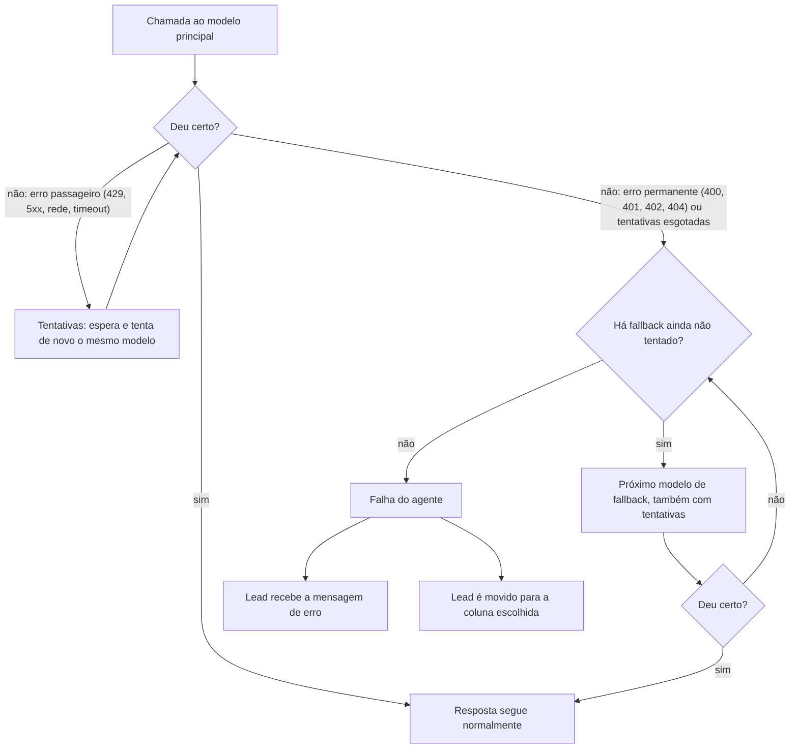

Todo provider falha às vezes: fica fora do ar, limita as chamadas, demora demais
ou fica sem crédito. O LangChain Agent tem três camadas para o lead não ficar sem
resposta:

1. **Tentativas (retry)**: tenta o mesmo modelo de novo, em erros passageiros.
2. **Fallback**: troca para um modelo de reserva.
3. **Falha do agente**: se todos os modelos falharem, manda uma mensagem segura
   ao lead e move o lead para uma coluna de transbordo, sem depender do modelo.

Configuração recomendada para todo projeto: **Tentativas 2**, **um modelo de
fallback de outro fabricante** e **Falha do agente** ligada, movendo para a
coluna de transbordo.

## A ordem em que agem



Em palavras: a **Falha do agente** fica por fora e só age quando **tudo** falhou.
Dentro dela, o **fallback** troca de modelo. Dentro do fallback, as **Tentativas**
repetem cada modelo. As tentativas valem para o principal e para cada modelo de
reserva.

### Quais erros são tentados de novo

| Erro | Exemplo | Tenta de novo? |
|---|---|---|
| 408, 409, 429 | Timeout do provider, limite de chamadas, sem cota na OpenAI | Sim |
| 5xx | Provider fora do ar | Sim |
| Falha de rede ou tempo esgotado | Conexão caiu, passou do **Timeout** | Sim |
| 400 | Parâmetro inválido, schema de tool inválido, Max Tokens acima do limite | Não: vai direto ao fallback |
| 401 | Chave errada | Não |
| 402 | Sem crédito no OpenRouter | Não |
| 404 | Modelo inexistente | Não |

Repetir um erro permanente só atrasaria a resposta: a chamada falharia igual.

Entre as tentativas, o agente espera **1 segundo** na primeira, e o dobro a cada
nova tentativa (com uma pequena variação aleatória), até 60 segundos.

## Como configurar

### Tentativas

Em **Agente → Configurações do modelo → Tentativas**: de **1 a 5**, em vezes. Use
**2**.

<Warning>
O retry só é gravado como ligado quando você altera o campo **Tentativas** e salva.
Em projetos novos ou migrados, o campo pode mostrar 2 com o retry desligado.
Confira pelo template (`model.retry.enabled`) ou altere o valor e salve.
</Warning>

### Fallback

Em **Configurações do modelo → Fallback**:

1. Ligue a chave.
2. Clique em **Adicionar modelo**, escolha o provider e digite o nome do modelo
   (por exemplo, `gpt-5-mini` na OpenAI ou `google/gemini-…` no OpenRouter).
3. **Mesmo provider do principal**: usa a mesma API Key, a não ser que você clique
   em **Usar chave própria**. **Provider diferente**: informe a chave dele.
4. Os modelos são tentados **na ordem da lista**.

Como escolher o modelo de reserva:

- **De outro fabricante.** Se o principal é da OpenAI, a reserva pode ser Gemini ou
  Claude pelo OpenRouter. Uma queda da OpenAI derruba todos os modelos dela.
- **Com outra chave, se o risco é crédito.** Fallback no mesmo provider com a mesma
  chave também fica sem saldo.
- **Com as mesmas modalidades.** Se o principal entende imagem, a reserva também
  precisa entender.
- **Que siga bem as suas tools.** Teste a reserva como principal num rascunho antes
  de confiar nela.

Um ou dois modelos de reserva bastam. Cada um a mais pode somar segundos de espera
numa falha.

### Falha do agente

Em **Agente → Configurações avançadas → Falha do agente**:

| Campo | O que faz | Padrão |
|---|---|---|
| **Avisar o lead** | Liga ou desliga esta camada | Ligado |
| **Mensagem ao lead** | O texto que o lead recebe quando todos os modelos falham | "Tive um problema tecnico aqui e nao consegui responder agora. Ja chamei um atendente para te ajudar!" |
| **Mover o lead para** | A coluna para onde o lead vai junto com a mensagem. Ao escolher, a tool que faz o movimento é criada sozinha | Não mover |

Escolha a **coluna de transbordo** do funil (a coluna com **Transbordo** ligado).
Entrar nela desliga a IA para o lead e avisa o responsável
([Funil (Kanban)](/produto/funil-kanban)). O movimento é feito sem o modelo, que
acabou de falhar.

Reescreva a mensagem padrão com acentos e no tom do cliente. Só prometa "já chamei
um atendente" se **Mover o lead para** estiver preenchido. Exemplo:

> "Desculpe, tive uma instabilidade aqui. Já passei sua conversa para a nossa
> equipe, que vai te responder em breve."

<Note>
Deixe **Avisar o lead** sempre ligado. É a única camada que garante uma resposta
em português, escrita por você, quando todos os modelos falham.
</Note>

## Tempo: Timeout, tentativas e o limite de 180 segundos

O servidor espera cada resposta do agente por até **180 segundos**, contando
todas as tentativas, todos os modelos e todas as tools. O **Timeout** de cada
chamada é de **60 segundos** por padrão.

Faça a conta do pior caso: Timeout × (1 + Tentativas) × número de modelos. Com
60 s, 2 tentativas e 1 fallback, o pior caso passa de 180 s, e o servidor corta
antes de a Falha do agente agir. Para caber:

- Timeout de **30 a 45 segundos**;
- **Tentativas 2**;
- **1 modelo de fallback**.

Quando o próprio agente não responde em 180 segundos, ou o serviço do agente
falha, o servidor tenta o mesmo lote de novo, até **3 vezes**, com **10 segundos**
entre elas. Se todas falharem, grava o erro no chat e dispara o webhook de erro
([Webhooks](/produto/automacoes/webhooks)).

## E quando a falha é de uma tool?

Falha de tool não aciona fallback de modelo. O modelo recebe o erro (com a
instrução `on_error` da tool, se houver) e decide o que dizer. Para repetir
chamadas a APIs instáveis, ligue **Repetir ao falhar** nas configurações das tools.
Ver [Tool HTTP](/engenharia-de-ia/tools/http) e
[Limites e segurança](/engenharia-de-ia/limites-e-seguranca).

## Como testar

No chat do builder, o teste usa a configuração que está na tela, sem publicar.

1. Troque o modelo principal por um nome que não existe (por exemplo,
   `modelo-teste`). **Não publique.**
2. Mande uma mensagem. Com fallback, quem responde é o modelo de reserva.
3. Desligue o fallback e mande outra. O chat mostra **"O modelo falhou"**, o erro
   do provider e se o lead foi transferido.
4. Volte o modelo principal e descarte o rascunho.

## Onde ver que uma falha aconteceu

- **No chat do lead**: aparece a mensagem de erro, e o lead está na coluna de
  transbordo.
- **No LangSmith**: a conversa mostra o erro de cada modelo e a troca para o
  fallback ([Observabilidade com LangSmith](/engenharia-de-ia/langsmith)).
- **Em [Logs](/produto/logs)**: erros que chegaram ao servidor.

## Pelo MCP

Tudo fica em `langchain.config`: `model.retry`, `model.fallback` e
`settings.error_handling`. A escrita cria uma versão não publicada.

<Visibility for="agents">
```json
{
  "model": {
    "provider": "openai",
    "name": "gpt-5-mini",
    "provider_options": { "timeout_seconds": 40 },
    "retry": { "enabled": true, "max_retries": 2 },
    "fallback": {
      "enabled": true,
      "models": [
        { "provider": "openrouter", "name": "google/gemini-…", "api_key": "<chave do OpenRouter>", "provider_options": {} }
      ]
    }
  },
  "settings": {
    "error_handling": {
      "enabled": true,
      "message": "Desculpe, tive uma instabilidade aqui. Já passei sua conversa para a nossa equipe.",
      "handoff_tool": "<nome da tool http kanban.move para a coluna de transbordo>"
    }
  }
}
```

- `model.retry`: `{enabled: false, max_retries: 2}` por padrão. Backoff fixo no
  agente: atraso inicial 1 s, fator 2, máximo 60 s, com jitter. Só repete status
  408, 409, 429, 5xx e erros sem status (rede, timeout).
- `model.provider_options.max_retries` (padrão 2) é a tentativa interna do cliente
  do provider, separada de `model.retry`.
- `model.fallback.enabled: true` exige `models` não vazio. `api_key: null` herda a
  do principal; use só no mesmo provider.
- `settings.error_handling.handoff_tool` precisa ser o `name` de uma tool
  `type: "http"` já declarada em `tools`. Nome que não casa: o lead recebe a
  mensagem e **não** é transferido (aviso só no log). Composio e MCP não servem.
- A tool de transbordo do builder é uma ação da Zatten `kanban.move` com
  `_zatten.target_id` = id da coluna com `transhipment: true`.
- Ordem dos middlewares: `ModelErrorHandoff` (fora) → `ModelFallback` →
  `ModelRetry(on_failure="error")` (dentro).
- Quando a Falha do agente age, o run termina como sucesso, com a mensagem segura.
  No playground, a resposta traz `zatten_error` (`status_code`, `exception`,
  `handoff`: `done`, `failed` ou `not_configured`).
</Visibility>

## Armadilhas

- **Fallback no mesmo provider e na mesma chave** não protege de queda do provider
  nem de falta de crédito.
- **Mensagem que promete atendente sem mover o lead**: o lead espera um humano que
  ninguém chamou.
- **Coluna de transbordo sem responsável no lead**: a IA é desligada, mas ninguém
  recebe o aviso. Garanta a distribuição por [departamento](/produto/departamentos).
- **Timeout alto com várias tentativas e fallbacks** passa de 180 segundos, e a
  Falha do agente não chega a agir.
- **Retry desligado sem você saber**: confira `model.retry.enabled`.
- **Fallback com modalidades diferentes**: numa falha, a imagem do lead deixa de
  ser entendida.
- **Sem crédito na OpenAI é 429**, que é tentado de novo: com saldo zerado, as
  tentativas só atrasam até o fallback. Ligue a recarga automática no provider.

## Perguntas frequentes

<AccordionGroup>
<Accordion title="O fallback volta para o modelo principal depois?">
Sim. A troca vale só para aquela chamada. A próxima mensagem começa de novo pelo
principal.
</Accordion>
<Accordion title="O lead percebe quando o fallback responde?">
Normalmente não, se o modelo de reserva segue bem o prompt e as tools. Por isso
teste a reserva antes.
</Accordion>
<Accordion title="Preciso de fallback se já tenho Tentativas?">
Sim. As tentativas resolvem instabilidade de segundos. Queda longa, chave errada e
falta de crédito só o fallback (com outra chave) resolve.
</Accordion>
<Accordion title="E se eu desligar Avisar o lead?">
O lead não recebe nada. A falha vira erro do agente, e o servidor tenta o mesmo
lote de novo até 3 vezes, com 10 segundos entre elas (cada tentativa repete
Tentativas e fallback). Se todas falharem, o erro é gravado no chat e o webhook de
erro dispara, mas ninguém avisa o lead nem o move de coluna. Mantenha ligado.
</Accordion>
</AccordionGroup>

## Para saber mais

- [Como o agente da Zatten funciona](/engenharia-de-ia/como-o-agente-funciona)
- [Providers: OpenAI e OpenRouter](/engenharia-de-ia/providers)
- [Escolher o modelo](/engenharia-de-ia/escolher-o-modelo)
- [Transbordo (playbook)](/playbooks/transbordo)
- LangChain, middlewares prontos (retry, fallback): https://docs.langchain.com/oss/python/langchain/middleware/built-in
- OpenRouter, fallback entre modelos: https://openrouter.ai/docs/guides/routing/model-fallbacks
- OpenRouter, roteamento de provider: https://openrouter.ai/docs/guides/routing/provider-selection
- OpenRouter, erros: https://openrouter.ai/docs/api/reference/errors-and-debugging
- OpenAI, códigos de erro: https://developers.openai.com/api/docs/guides/error-codes
- OpenAI, limites de uso: https://developers.openai.com/api/docs/guides/rate-limits

**Termos para buscar:** "ModelFallbackMiddleware", "ModelRetryMiddleware",
"exponential backoff jitter", "429 rate limit retry", "LLM fallback model",
"graceful degradation chatbot".
